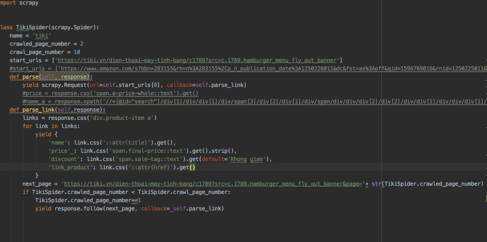
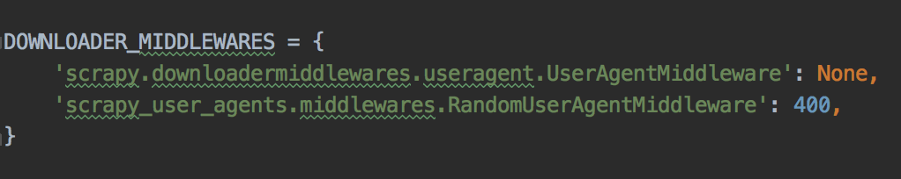

# TanLeNghia_18020949_Nhom4_Crawler_1
# CRAWL TIKI VỀ MÁY-TÍNH-BẢNG-ĐIỆN-THOẠI
## Mô tả
Trong file tiki.py

Gồm 2 hàm parse và parse_link 
+ <strong>crawled_page_number</strong> là số trang đã craw 
+ <strong>crawl_page_number</strong> là tổng số trang muốn crawl
### parse
hàm parse tạo Request đến link đã được truyền vào bằng start_urls[0]
### parse_link
Trích xuất thông tin các sản phẩm trong mỗi page trả về bằng câu lệnh:
<strong>links = response.css('div.product-item a')</strong> 
Và với mỗi <strong>link in links</strong> chúng ta sẽ có các thông tin:
+ 'name':tên sản phẩm
+ 'price':giá
+ 'discount':giảm bao nhiêu phần trăm
+ 'link_product':tên sản phẩm  

Với <strong>nextpage</strong> và <strong>crawled_page_number</strong> sẽ tạo ra một link mới để truy xuất đến trang kế tiếp tiếp tục Crawl sản phẩm cho tới khi số trang đã crawl bằng số trang muốn
crawl <strong>crawl_page_number</strong> 

Trong file settings.py

Thêm dòng code trên với mục đích thay đổi user agents để pass restriction của tiki  
Random với số user agents là 400
